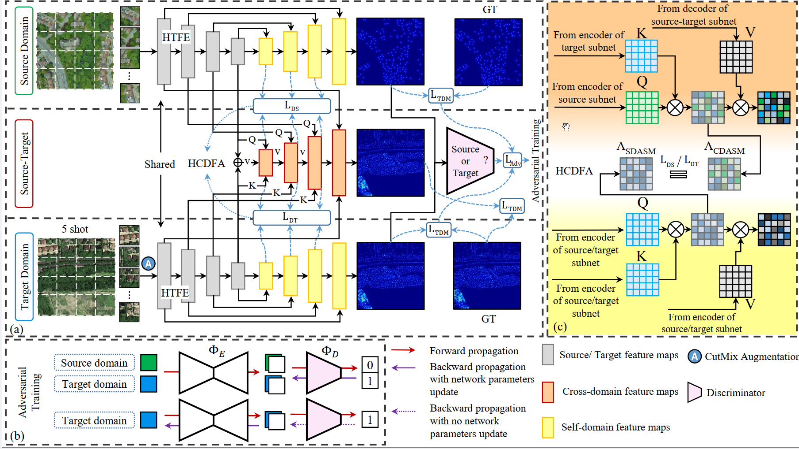

# AdaTreeFormer

This is the code base for ISPRS Journal of Photogrammetry and Remote Sensing paper ['AdaTreeFormer: Few Shot Domain Adaptation for Tree Counting from a Single High-Resolution Image'](https://arxiv.org/abs/2402.02956)



## Installation

Python ≥ 3.7.

To install the required packages, please run:


```bash
  pip install -r requirements.txt
```
    
## Dataset
Download the London dataset from [google drive](https://drive.google.com/file/d/1xcjv8967VvvzcDM4aqAi7Corkb11T0i2/view?usp=drive_link).

Download the Yoesmite dataset from [google drive](https://drive.google.com/drive/folders/1NWAqslICPoTS8OvT8zosI0R7cmsl6x9j).

Download the Jiangsu dataset from [zenodo](https://zenodo.org/records/4771236).


Modify the path to the dataset and model for evaluation in 'test.py'.

Run 'test.py'
## Acknowledgements

 - Part of codes are borrowed from [SWIN](https://github.com/microsoft/Swin-Transformer) and [DM Count](https://github.com/cvlab-stonybrook/DM-Count). Thanks for their great work!
 
